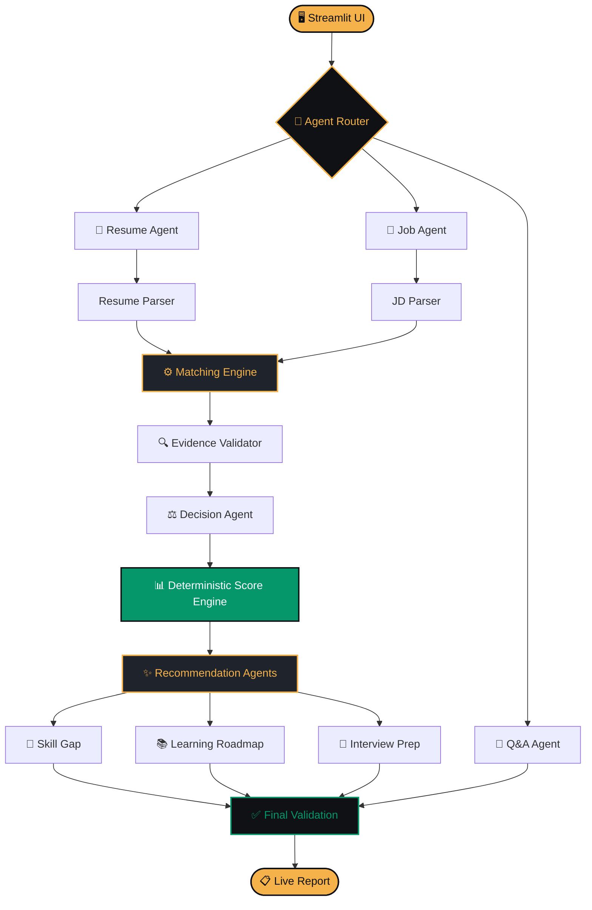

AI Resume & Job Matching Agent

> **Understand → Extract → Compare → Decide → Recommend**

A production-quality **agentic AI system** that intelligently analyzes a candidate's resume against a target job description and produces an explainable, evidence-based match report — complete with skill gaps, a personalized learning roadmap, and interview preparation.

Built for the **AI Agent Competition**.

---

##  Live Demo

👉 **[Try the live app](https://ai-resume-job-matching-agent-ky6qsfbyy5x2idbdm835rv.streamlit.app/)**

Click **"Run Demo"** in the sidebar to see the full pipeline in action on a sample resume + AI/ML Engineer job description.


---

##  Key Features

-  **Multi-Agent Orchestration** — Resume Agent, Job Agent, Matching Agent, Decision Agent, Recommendation Agent, Q&A Agent
-  **Evidence-Based Matching** — Every match backed by a resume snippet. No hallucinations.
-  **Deterministic Scoring** — 6-bucket weighted score computed by code, never by the LLM
-  **Hallucination Prevention** — Every claim re-validated against raw resume text
-  **Explainable AI** — "Why this score?" panel breaks down every point of the 0–100 result
-  **Skill Gap Analysis** — CRITICAL / IMPORTANT / NICE-TO-HAVE priorities
-  **Learning Roadmap** — Time-boxed (IMMEDIATE / 1–2 WEEKS / 1 MONTH / 2–3 MONTHS)
-  **Interactive Q&A Chat** — Ask the agent about your analysis
-  **Multi-Job Compare** — Rank the same resume against multiple JDs
-  **Privacy-First** — Resumes processed in-memory, nothing written to disk
-  **Downloadable Report** — One-click Markdown export

---

##  Architecture




### 🔄 The 5-Stage Agentic Pipeline

| Stage | Description |
|-------|-------------|
| **1️⃣ UNDERSTAND** | Agent Router identifies user intent and routes to the correct workflow |
| **2️⃣ EXTRACT** | Resume Agent + Job Agent parse inputs into typed Pydantic schemas |
| **3️⃣ COMPARE** | Matching Engine evaluates every requirement against resume evidence |
| **4️⃣ DECIDE** | Evidence Validator + Decision Agent assign statuses with confidence scores |
| **5️⃣ RECOMMEND** | Recommendation Agents generate gaps, roadmap, interview prep, and report |

## 🛠️ Tech Stack

| Layer | Technology |
|-------|------------|
| **Language** | Python 3.11+ |
| **UI Framework** | Streamlit |
| **Data Validation** | Pydantic v2 |
| **Document Parsing** | pypdf, python-docx |
| **Charts** | Plotly |
| **LLM Provider** | OpenAI GPT-5.4 (via Emergent Universal LLM Key) |
| **Fallback Mode** | Rule-based (fully offline) |
| **Testing** | pytest (8/8 tests passing) |
| **Deployment** | Streamlit Community Cloud |

---

##  Quick Start

### Prerequisites
- Python 3.11 or higher
- Git

### Installation

```bash
# Clone the repo
git clone https://github.com/harshmeshram2004/Ai-resume-job-matching-agent.git
cd Ai-resume-job-matching-agent

# Create virtual environment
python -m venv .venv

# Activate (Windows)
.venv\Scripts\Activate.ps1

# Activate (Mac/Linux)
source .venv/bin/activate

# Install dependencies
pip install -r streamlit_app/requirements.txt

# Run the app
streamlit run streamlit_app/app.py
Open http://localhost:8501 in your browser.

Optional: Enable Cloud LLM
Create a .streamlit/secrets.toml file:

EMERGENT_LLM_KEY = "your-key-here"
Or use Local / Rule-based mode in the sidebar — no key required.

 Scoring Methodology
The final match score is computed deterministically by code — the LLM never picks the number.

Bucket	Default Weight
Required Skills	40%
Experience	25%
Projects	15%
Education	10%
Preferred Skills	5%
Other Evidence	5%
Score Interpretation:

90–100 → Excellent Match
80–89 → Strong Match
70–79 → Good Match
60–69 → Moderate Match
40–59 → Weak Match
0–39 → Low Match
Weights are configurable in the sidebar.

 Match Statuses
Status	Meaning
 MATCHED	Explicit evidence with high confidence
 PARTIALLY_MATCHED	Some evidence but incomplete
 RELATED	Related skill present, not equivalent
 MISSING	Not found in resume
 UNKNOWN	Insufficient information
 Testing
pytest streamlit_app/tests -q
Test suite covers:

✅ PDF/DOCX/TXT parsing
✅ Deterministic scoring reproducibility
✅ Hallucination prevention (skills not in resume are NEVER marked MATCHED)
✅ Related-skill detection
✅ End-to-end pipeline execution
📁 Project Structure
streamlit_app/
├── app.py                    # Streamlit UI with 10 tabs
├── requirements.txt
├── README.md
│
├── agents/                   # 5 specialized agents
│   ├── router.py
│   ├── resume_agent.py
│   ├── job_agent.py
│   └── qa_agent.py
│
├── tools/                    # 13 callable tools
│   ├── resume_parser.py
│   ├── job_parser.py
│   ├── extraction.py
│   ├── matcher.py
│   ├── evidence_validator.py
│   ├── scoring.py
│   ├── skill_gap.py
│   ├── experience.py
│   ├── recommendations.py
│   ├── learning.py
│   ├── interview.py
│   ├── comparison.py
│   └── report.py
│
├── models/schemas.py         # Pydantic models
├── llm/                      # LLM provider abstraction
├── utils/                    # Config, logging, helpers
├── tests/                    # 8 passing unit tests
└── sample_data/              # Sample resume + 3 JDs
 Ethics & Privacy
Privacy: Uploaded resumes are processed entirely in-memory. Nothing is persisted to disk.
Ethics: The system evaluates only job-relevant qualifications. Protected characteristics (gender, race, religion, age, disability, nationality) are never used for scoring.
Disclaimer: The score is an alignment estimate, not a hiring prediction. It should support, not replace, human judgment.

 Demo Instructions for Judges
Open the live app
Select Cloud (Emergent LLM Key) in the sidebar
Enable Show agent workflow trace
Click Run Demo
Explore all 10 tabs
Ask the agent: "Why did I get this score?"
Try Multi-Job Compare with your own JD
Download the Markdown report
 Current Limitations & Roadmap
 OCR support for scanned PDFs (planned)
 Sentence-transformer embeddings for richer semantic matching
 PDF report export (currently Markdown)
 Recruiter Mode — bulk-rank many resumes against one JD

 License
This project is submitted as part of the AI Agent Competition. All rights reserved to the contributors.

